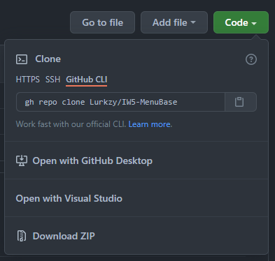
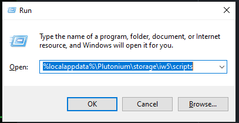
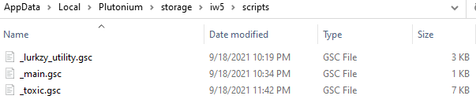

# IW5-MenuBase

  

  

this was the mod menu base I was using for Toxic, my IW5 Azza Menu I planned to release for free. I have run into some issues due to my own stupidity and I'm not sure if I will continue my work on the menu. I am releasing this because it is a simple, easy to understand base which is perfect for beginners, or some lazy script kiddie who doesn't want to write a base. I was going to add infinite scroll since I hate adding new sub menus for a few leftover options that need to be added but never got around to it; so feel free to do so.

 

## How to install

  - Click the `Green Code button` at the top of the page and click `Download ZIP` 
  - Press `Win + R` to open the run popup, or search `Run` in your taskbar search 
  - extract the files to `%localappdata%\Plutonium\storage\iw5\scripts` as shown 

## How to edit

| item                        | Description                                    |
|:----------------------------|:-----------------------------------------------|
| `referencing`               | All files within the scripts folder will need a `scripts\` prefix when referencing them |
| `quick test`                | a command I use to test quickly, `/map mp_seatown;scr_war_timelimit 0;scr_war_scorelimit 0;sv_cheats 1` just paste it into your console |
| `addNewMenu`                | Add a new Submenu to the base, it takes 2 arguments `menu` and `parent` |
| `addNewOption`              | Add a new option to said menu, it takes 5 arguments `menu`, `index`, `name`, `function`, `argument` |
| `createTextElem`            | Create a new Text Element, it takes 12 arguments `font`, `scale`, `align`, `relative`, `x`, `y`, `sort`, `color`, `alpha`, `glowColor`, `glowAlpha`, `text` |
| `createBarElem`             | Create a new Bar Element, it takes 10 arguments `align`, `relative`, `x`, `y`, `width`, `height`, `color`, `alpha`, `sort`, `shader` |

 
